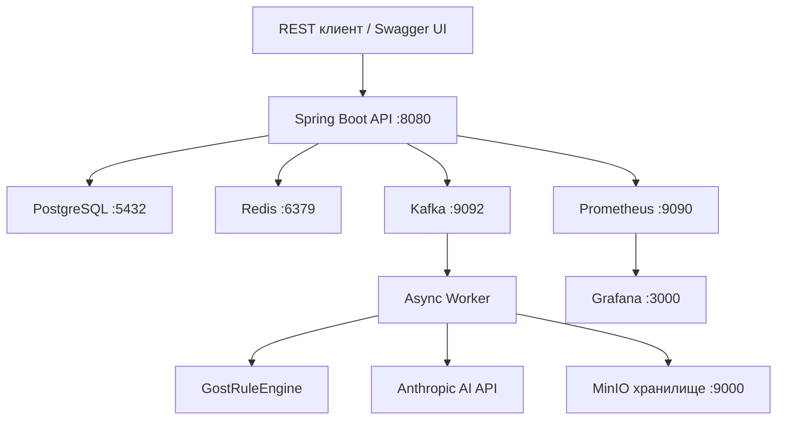

# 🔍 НормаКонтроль
> Java программа — автоматическая проверка документов по ГОСТ 19.201-78

Технологии: Java 17 | Spring Boot 3.2 | PostgreSQL | Redis | Kafka | Docker

## Что умеет программа
- Загружает документы DOCX, PDF, TXT, MD
- Проверяет по 6 группам правил ГОСТ 19.201-78
- Показывает прогресс проверки в реальном времени через WebSocket
- Генерирует AI-рекомендации по каждому нарушению
- Сравнивает две версии документа и показывает, что исправили
- Генерирует PDF-отчёт с детальными результатами
- Ведёт журнал действий пользователей и системы
- Предоставляет REST API с документацией Swagger UI

## Запуск программы
```bash
git clone https://github.com/idayatali/normacontrol
cp .env.example .env
docker-compose up -d
```

Программа запустится на `http://localhost:8080`  
Swagger UI: `http://localhost:8080/api/swagger-ui`  
Grafana: `http://localhost:3000`

## Архитектура


## Все API эндпоинты
```text
POST   /api/v1/auth/register          — регистрация
POST   /api/v1/auth/login             — вход, получить JWT
POST   /api/v1/auth/refresh           — обновить токен
POST   /api/v1/auth/logout            — выход

POST   /api/v1/documents              — загрузить документ
GET    /api/v1/documents              — список документов
GET    /api/v1/documents/{id}         — статус документа
DELETE /api/v1/documents/{id}         — удалить документ
GET    /api/v1/documents/{id}/report  — скачать PDF отчёт
POST   /api/v1/documents/compare      — сравнить две версии

GET    /check-results/document/{id}   — получить последний результат проверки
GET    /check-results/{id}            — получить результат по ID

GET    /api/v1/admin/audit            — журнал аудита (ADMIN)
GET    /api/v1/admin/audit/export     — выгрузить CSV (ADMIN)
GET    /api/v1/admin/stats            — статистика (ADMIN)

WS     /ws → /topic/check/{docId}     — прогресс в реальном времени
```

## Backend-only
Проект является Java Spring Boot backend-программой.  
Фронтенд не используется. Интерфейс для тестирования API — только Swagger UI.
