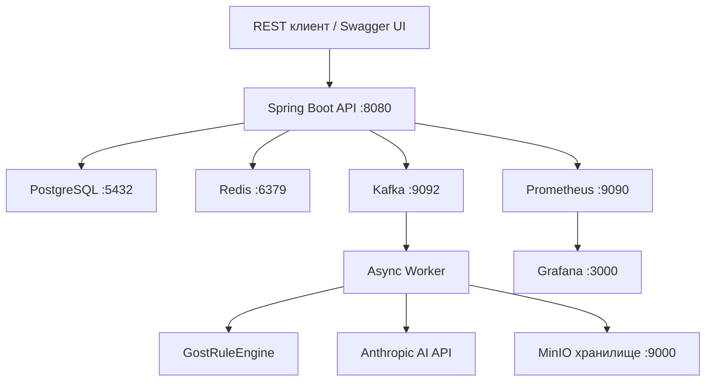

# 🔍 Программа «НормаКонтроль»
> Программа автоматической проверки документов на соответствие ГОСТ 19.201-78

## О программе

**«НормаКонтроль»** — это серверная программа для автоматического контроля технической документации на соответствие стандарту **ГОСТ 19.201-78** «Техническое задание. Требования к содержанию и оформлению».

Программа реализована на языке **Java 17** с использованием фреймворка **Spring Boot 3.2** и предоставляет REST API для взаимодействия с клиентскими приложениями.

### Технологический стек
| Компонент | Технология |
|-----------|------------|
| Язык | Java 17 |
| Фреймворк | Spring Boot 3.2 |
| База данных | PostgreSQL |
| Кэширование | Redis |
| Очередь сообщений | Apache Kafka |
| Хранилище файлов | MinIO |
| Мониторинг | Prometheus + Grafana |
| Контейнеризация | Docker |

## Функциональные возможности программы

1. **Загрузка документов** — поддержка форматов DOCX, PDF, TXT, MD
2. **Автоматическая проверка по ГОСТ 19.201-78** — 6 стратегий проверки:
   - `STRUCT` — проверка структуры документа (обязательные разделы)
   - `FMT` — проверка форматирования (шрифт, кегль, выравнивание)
   - `TBL` — проверка оформления таблиц
   - `FIG` — проверка оформления рисунков
   - `LANG` — проверка стиля языка (сокращения, время глаголов)
   - `REF` — проверка списка литературы
3. **Отображение прогресса в реальном времени** — через WebSocket
4. **AI-рекомендации** — генерация контекстных рекомендаций по исправлению нарушений
5. **Сравнение версий документа** — анализ diff нарушений между двумя версиями
6. **Генерация PDF-отчёта** — детальный отчёт с результатами проверки
7. **Журнал аудита** — логирование всех действий пользователей и системы
8. **REST API** — полнофункциональный API с документацией Swagger UI
9. **Безопасность** — JWT аутентификация, RBAC (USER, REVIEWER, ADMIN)
10. **Защита от brute-force** — блокировка после 5 неудачных попыток входа

## Запуск программы
```bash
git clone https://github.com/idayatali/normacontrol
cp .env.example .env
docker-compose up -d
```

Программа запустится на `http://localhost:8080`  
Swagger UI: `http://localhost:8080/api/swagger-ui`  
Grafana: `http://localhost:3000`

## Архитектура программы

Программа построена по принципам **чистой архитектуры (Clean Architecture)** с разделением на слои:

```
ru.normacontrol
├── domain         — доменные сущности, интерфейсы репозиториев, правила проверки
├── application    — use case'ы, DTO, маппинг, события
├── infrastructure — реализация репозиториев, Kafka, MinIO, JWT, Redis, AI
└── presentation   — REST-контроллеры, обработка ошибок
```

### Паттерны проектирования
- **Strategy** — стратегии проверки (CheckStrategy)
- **Observer** — доменные события (DomainEventPublisher)
- **Builder** — построение отчётов (CheckReportBuilder)
- **Adapter** — адаптеры репозиториев (Repository Adapter)
- **CQRS** — разделение Read/Write репозиториев



## API программы
```text
POST   /api/v1/auth/register          — регистрация пользователя
POST   /api/v1/auth/login             — авторизация, получение JWT
POST   /api/v1/auth/refresh           — обновление токена
POST   /api/v1/auth/logout            — выход из системы

POST   /api/v1/documents              — загрузить документ на проверку
GET    /api/v1/documents              — список документов пользователя
GET    /api/v1/documents/{id}         — информация о документе
DELETE /api/v1/documents/{id}         — удалить документ
GET    /api/v1/documents/{id}/report  — скачать PDF-отчёт
POST   /api/v1/documents/compare      — сравнить две версии документа

GET    /api/v1/check-results/document/{id}          — последний результат проверки
GET    /api/v1/check-results/document/{id}/history   — история проверок
GET    /api/v1/check-results/{id}                    — результат по ID

GET    /users/me                      — профиль текущего пользователя
GET    /users/{userId}                — профиль по ID (REVIEWER/ADMIN)
PATCH  /admin/users/{userId}/toggle   — блокировка пользователя (ADMIN)

GET    /api/v1/admin/audit            — журнал аудита (ADMIN)
GET    /api/v1/admin/audit/export     — выгрузить CSV аудита (ADMIN)
GET    /api/v1/admin/stats            — статистика системы (ADMIN)

WS     /ws → /topic/check/{docId}     — прогресс проверки в реальном времени
```

## Примечание
**Программа является серверным Java-приложением (backend).**  
Для тестирования API используется встроенный интерфейс **Swagger UI**.  
Фронтенд-интерфейс (HTML/CSS/JS) не входит в состав программы — взаимодействие осуществляется через REST API.
