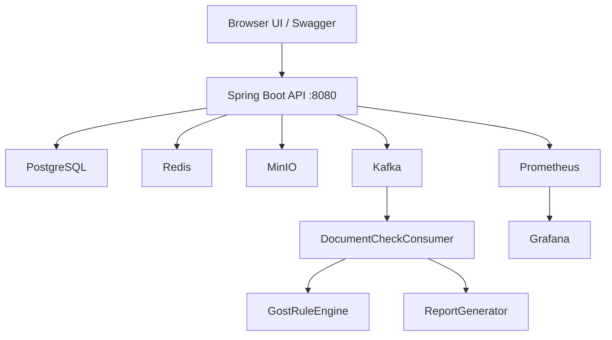

# НормаКонтроль

Система «НормаКонтроль» автоматически проверяет DOCX, PDF, TXT и MD документы на соответствие требованиям ГОСТ 19 и ГОСТ 7.32. Приложение принимает документ, сохраняет файл в MinIO, запускает асинхронную проверку через Kafka, применяет набор правил нормоконтроля, считает итоговый балл и формирует отчёты HTML, PDF и JSON.

## Возможности

- регистрация, JWT-вход, refresh token, logout и OAuth2 GitHub/Google;
- загрузка документов до 50 МБ;
- фильтрация документов по статусу, типу и дате;
- проверка структуры, форматирования, таблиц, рисунков, языка и ссылок;
- асинхронная обработка через Apache Kafka;
- история проверок и статусы документа;
- автоисправление DOCX;
- антиплагиат по базе загруженных документов;
- импорт/экспорт правил JSON;
- отчёты HTML, PDF, JSON и CSV-экспорт статистики;
- webhook после завершения проверки;
- аудит, rate limit, RBAC, GDPR-экспорт и анонимизация;
- Swagger/OpenAPI, Prometheus, Grafana, Docker, Kubernetes, CI/CD.

## Архитектура

Проект построен по Clean/Hexagonal Architecture:

```text
ru.normacontrol
├── domain         доменные сущности, правила ГОСТ, сервисы домена
├── application    use case'ы, DTO, mapper'ы, orchestration
├── infrastructure JPA, Kafka, MinIO, Redis, security, reports
└── presentation   REST controllers, static UI, error handling
```


```mermaid
graph TB
  UI["Browser UI / Swagger"] --> API["Spring Boot API :8080"]
  API --> PG["PostgreSQL"]
  API --> Redis["Redis"]
  API --> MinIO["MinIO"]
  API --> Kafka["Kafka"]
  Kafka --> Worker["DocumentCheckConsumer"]
  Worker --> Engine["GostRuleEngine"]
  Worker --> Reports["ReportGenerator"]
  API --> Prom["Prometheus"]
  Prom --> Grafana["Grafana"]
```

Больше диаграмм находится в [docs/DIAGRAMS.md](docs/DIAGRAMS.md).

## Технологии

| Категория | Технологии |
|---|---|
| Backend | Java 17, Spring Boot 3.2 |
| Security | Spring Security, JWT, OAuth2, RBAC, bcrypt |
| Database | PostgreSQL 15+, Liquibase |
| Queue | Apache Kafka |
| Cache | Redis |
| Storage | MinIO |
| Documents | Apache POI, PDFBox, iText 7 |
| API docs | SpringDoc OpenAPI / Swagger UI |
| Monitoring | Micrometer, Prometheus, Grafana |
| Tests | JUnit 5, Mockito, Testcontainers, Jacoco |
| DevOps | Docker, Docker Compose, Kubernetes, GitHub Actions |

## Локальный запуск

```bash
docker compose up -d
```

Или на Windows:

```bat
start.bat
```

Адреса:

```text
Приложение: http://localhost:8080
Swagger UI:  http://localhost:8080/api/docs
OpenAPI:     http://localhost:8080/api/openapi
Grafana:     http://localhost:3000
Health:      http://localhost:8080/actuator/health
```

Демо-вход:

```text
admin@demo.ru / Admin1234!
user@demo.ru / User1234!
```

OAuth2 включается через переменные окружения:

```text
GOOGLE_CLIENT_ID
GOOGLE_CLIENT_SECRET
GITHUB_CLIENT_ID
GITHUB_CLIENT_SECRET
```

## Основные API

```text
POST   /api/v1/auth/register
POST   /api/v1/auth/login
POST   /api/v1/auth/refresh
POST   /api/v1/auth/logout
GET    /oauth2/authorization/github
GET    /oauth2/authorization/google

GET    /api/v1/users/me
PATCH  /api/v1/users/me
GET    /api/v1/users/me/export
DELETE /api/v1/users/me

POST   /api/v1/documents
GET    /api/v1/documents?status=CHECKED&type=docx&createdFrom=2026-05-01
GET    /api/v1/documents/{id}
GET    /api/v1/documents/{id}/download
POST   /api/v1/documents/{id}/check
GET    /api/v1/documents/{id}/result
GET    /api/v1/documents/{id}/report/download
GET    /api/v1/documents/{id}/report/html
GET    /api/v1/documents/{id}/report/json
POST   /api/v1/documents/{id}/fix
PUT    /api/v1/documents/{id}/webhook

GET    /api/v1/rule-settings
PATCH  /api/v1/rule-settings
GET    /api/v1/rule-settings/export
POST   /api/v1/rule-settings/import

GET    /api/v1/stats/export.csv
GET    /api/v1/admin/audit
GET    /api/v1/admin/audit/export
```

## Проверка перед защитой

```bash
docker compose up -d
curl http://localhost:8080/actuator/health
curl http://localhost:8080/api/docs
```

Документы для защиты:

- [docs/TZ_COMPLIANCE.md](docs/TZ_COMPLIANCE.md)
- [docs/DEFENSE_GUIDE.md](docs/DEFENSE_GUIDE.md)
- [docs/USER_GUIDE.md](docs/USER_GUIDE.md)
- [docs/SYSADMIN_GUIDE.md](docs/SYSADMIN_GUIDE.md)
- [docs/DIAGRAMS.md](docs/DIAGRAMS.md)
