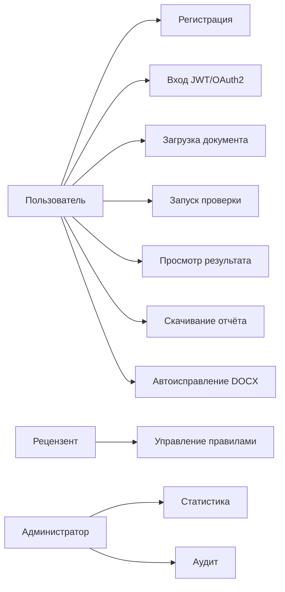
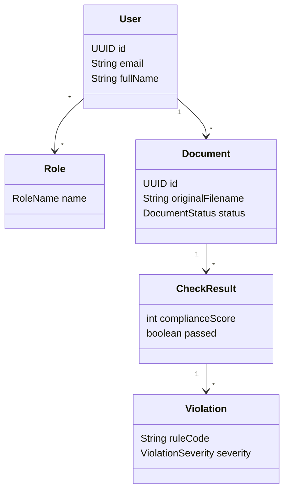
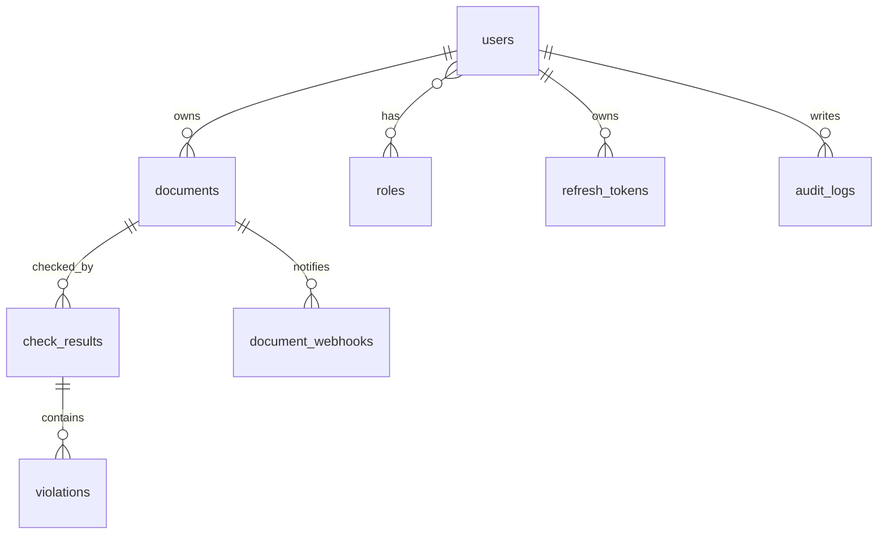
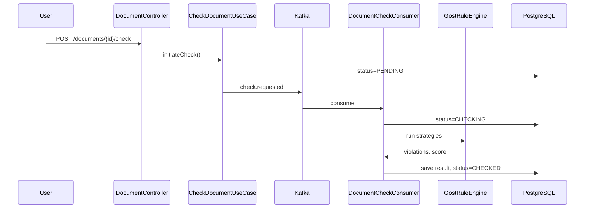
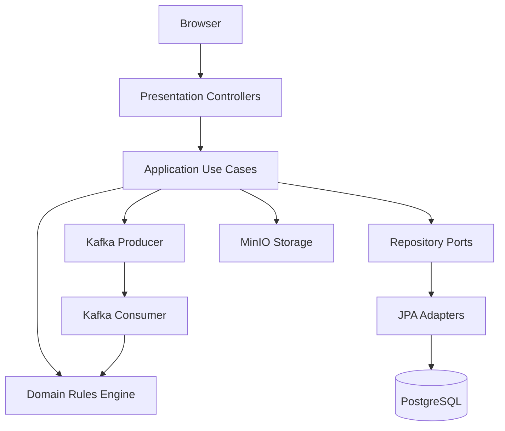
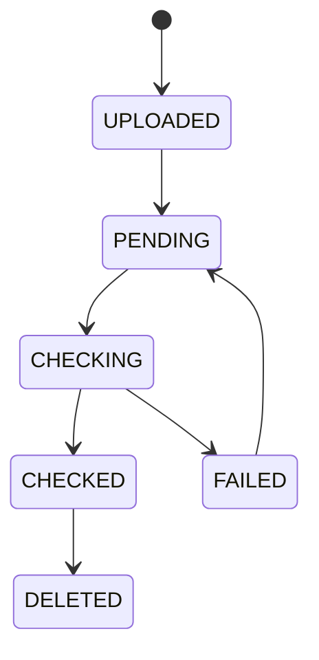
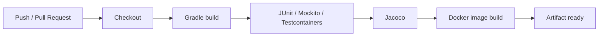
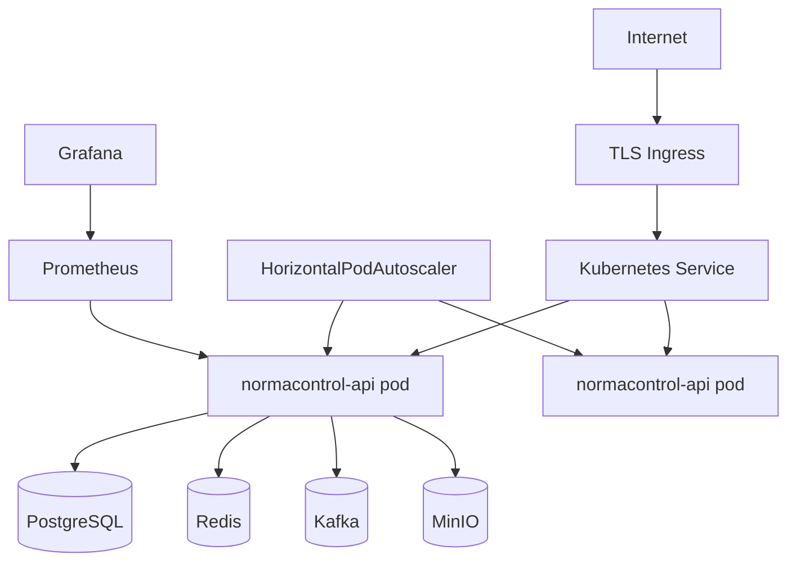

# Диаграммы проекта

## 1. Use Case

## 2. Доменная модель

## 3. ER Diagram

## 4. Sequence: запуск проверки

## 5. C4 Level 2 Components

## 6. Состояния документа

## 7. CI/CD Pipeline

## 8. Deployment

